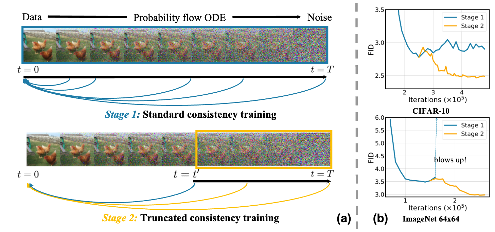

# TCM: Truncated Consistency Models

This is the official implementation of our paper [Truncated Consistency Models](https://truncated-cm.github.io/).

- Tested environment: PyTorch 2.3.1, Python 3.8.13.
- Dependencies: `pip install click Pillow psutil requests scipy tqdm matplotlib wandb`
- We tested with NVIDIA A100 GPUs.

# Dataset

We use the CIFAR-10 and ImageNet datasets for training and evaluation.
You should prepare CIFAR-10 following [EDM](https://github.com/NVlabs/edm), and ImageNet following [EDM2](https://github.com/NVlabs/edm2).

# Pre-trained models
The pre-trained TCM/EDM/EDM2 checkpoints are provided in this [link](https://drive.google.com/drive/folders/1gw6OMKCKaEe3LxSSlJKNhwG-M92u9DsW?usp=sharing).


| Model                              | Dataset        | 1-step FID | 2-step FID |
|------------------------------------|----------------|------------|------------|
| [TCM (DDPM++)](https://drive.google.com/file/d/1M9djFtf03acsmeAlseaOu2Z2AjQDE1Uz/view?usp=drive_link)                  | CIFAR-10       | 2.46       | 2.05       |
| [TCM (EDM2-S)](https://drive.google.com/file/d/1RhM0f-SHb_qpiMV9Br2fjE5w2CVYiHFE/view?usp=drive_link)       | ImageNet64x64  | 2.88       | 2.31       |
| [TCM (EDM2-XL)](https://drive.google.com/file/d/1XE1RzrTI_dZq-jE0aZ6A5-5naslGaA_F/view?usp=drive_link)      | ImageNet64x64  | 2.20       | 1.62       |


# Training


Stage-1 (CIFAR-10):
```bash
iteration=3000000
bsize=512
double_iter=25000
print_iter=100
save_iter=10000
vis_iter=1000

# Convert to kimg
duration=$(($iteration * $bsize / 1000000))

# Convert to ticks
double=$(($double_iter/ 100))
snap=$(($save_iter / 100))
vis=$(($vis_iter / 100))


torchrun --nnodes=1 --nproc_per_node=8 --rdzv_backend=c10d --rdzv_endpoint=localhost:8888 ct_train.py --use_wandb False --outdir=ct-runs/09.26 --desc 09.26.cifar.stage1 --arch=ddpmpp \
  --duration=$duration --double=$double --batch=$bsize --snap $snap --dump $snap --ckpt $snap --eval_every $snap --sample_every $vis \
  --dropout=0.2 --ratio_limit 0.999 --weighting default -c 1e-8 \
  --transfer=https://nvlabs-fi-cdn.nvidia.com/edm/pretrained/edm-cifar10-32x32-uncond-vp.pkl \
  --metrics='fid50k_full' --lr=1e-4 --cond=0  --optim=RAdam --augment=0.0 --mean=-1.1 --std=2.0 \
  --data=../datasets/cifar10-32x32.zip
```

Stage-2 (CIFAR-10):
```bash
iteration=3000000
bsize=1024
double_iter=25000
print_iter=100
save_iter=10000
vis_iter=1000

# Convert to kimg
duration=$(($iteration * $bsize / 1000000))

# Convert to ticks
double=$(($double_iter/ 100))
snap=$(($save_iter / 100))
vis=$(($vis_iter / 100))


torchrun --nnodes=1 --nproc_per_node=8 --rdzv_backend=c10d --rdzv_endpoint=localhost:8888 ct_train.py --use_wandb False --outdir=ct-runs/09.26 --desc 09.26.cifar.stage2 --arch=ddpmpp \
  --duration=$duration --double=$double --batch=$bsize --snap $snap --dump $snap --ckpt $snap --eval_every $snap --sample_every $vis \
  --dropout=0.2 --ratio_limit 0.999 --weighting default -c 1e-8 \
  --tcm_transition_t=1 --t_lower=1 --tcm_teacher_pkl=<PATH_TO_STAGE1_MODEL.pkl> \
  --transfer=<PATH_TO_STAGE1_MODEL.pkl> --resume_tick=<TICK_OF_STAGE1_MODEL> \
  --metrics='fid50k_full' --lr=5e-5 --cond=0  --optim=RAdam --augment=0.0 \
  --mean=0 --std=0.2 --boundary_prob=0.25 --w_boundary=0.1 --tdist=t --df=0.01 \
  --data=../datasets/cifar10-32x32.zip
```

Stage-1 (ImageNet 64x64):
```bash
iteration=800000
bsize=2048
double_iter=10000
print_iter=100
save_iter=10000
vis_iter=1000

# Convert to kimg
duration=$(($iteration * $bsize / 1000000))

# Convert to ticks
double=$(($double_iter/ 100))
snap=$(($save_iter / 100))
vis=$(($vis_iter / 100))

torchrun --nnodes=8 --nproc_per_node=8 --rdzv_backend=c10d --rdzv_endpoint=localhost:8888 ct_train.py --use_wandb False --cond=1 --outdir=ct-runs/ --desc imagenet.stage1  --fp16=1 --ls=16 --arch=edm2-img64-s --augment=0 \
  --duration=$duration --double=$double --batch=$bsize --snap $snap --dump $snap --ckpt $snap --eval_every $snap --sample_every $vis \
  --dropout=0.4 --ratio_limit 0.9961 --weighting cout_sq -c 0.06\
  --decay_iter=2000 --optim=Adam --rampup_iter=0 --lr=1e-3 --beta2=0.99  --metrics=fid50k_full --ema_gamma=16.97 --ema_type=power -q 4 \
  --data=../datasets/imgnet64x64-dhariwal.zip --transfer=edm2-imgnet64-s.pth \
  --mean=-0.8 --std=1.6
```

Stage-2 (ImageNet 64x64):
```bash
iteration=800000
bsize=1024
double_iter=10000
print_iter=100
save_iter=10000
vis_iter=1000

# Convert to kimg
duration=$(($iteration * $bsize / 1000000))

# Convert to ticks
double=$(($double_iter/ 100))
snap=$(($save_iter / 100))
vis=$(($vis_iter / 100))

torchrun --nnodes=8 --nproc_per_node=8 --rdzv_backend=c10d --rdzv_endpoint=localhost:8888 ct_train.py --use_wandb False --cond=1 --outdir=ct-runs/ --desc imagenet.stage2  --fp16=1 --ls=16 --arch=edm2-img64-s --augment=0 \
  --duration=$duration --double=$double --batch=$bsize --snap $snap --dump $snap --ckpt $snap --eval_every $snap --sample_every $vis \
  --dropout=0.4 --ratio_limit 0.9961 --weighting cout_sq -c 0.06 \
  --tcm_transition_t=1 --t_lower=1 --tcm_teacher_pkl=<PATH_TO_STAGE1_MODEL.pkl> \
  --transfer=<PATH_TO_STAGE1_MODEL.pkl> --resume_tick=<TICK_OF_STAGE1_MODEL> \
  --decay_iter=8000 --optim=Adam --rampup_iter=0 --lr=5e-4 --beta2=0.99  --metrics=fid50k_full --ema_gamma=16.97 --ema_type=power -q 4 \
  --data=../datasets/imgnet64x64-dhariwal.zip --mean=0 --std=0.2 --boundary_prob=0.25 --w_boundary=0.1 --tdist=t --df=0.01
```

# Sampling

```bash
# Evaluate a CIFAR-10 model with 4 GPUs
torchrun --standalone --nproc_per_node=4 ct_eval.py  \
    --outdir=ct-evals --data=../datasets/cifar10-32x32.zip             \
    --cond=0 --arch=ddpmpp --metrics=fid50k_full        \
    --resume cifar-stage2-2.46.pkl    

# Evaluate an ImageNet64 model (EDM2-S) with 4 GPUs
torchrun --standalone --nproc_per_node=4 ct_eval.py  \
    --outdir=ct-evals --data=../datasets/imgnet64x64-dhariwal.zip             \
    --cond=1 --arch=edm2-img64-s --metrics=fid50k_full --fp16=1       \
    --resume imgnet-stage2-edm2s-2.88.pkl 
```

# Acknowledgement
This code is built on the implementation of [EDM](https://github.com/NVlabs/edm) and [EDM2](https://github.com/NVlabs/edm2). We thank the authors for their great implementation.

# License
Copyright @ 2024, NVIDIA Corporation. All rights reserved.

This work is made available under the Nvidia Source Code License-NC.

The model checkpoints are shared under [`Attribution-NonCommercial-ShareAlike 4.0 International (CC BY-NC-SA 4.0)`](https://creativecommons.org/licenses/by-nc-sa/4.0/). If you remix, transform, or build upon the material, you must distribute your contributions under the same license as the original.

For business inquiries, please visit our website and submit the form: [NVIDIA Research Licensing](https://www.nvidia.com/en-us/research/inquiries/).


# Citation
```
@misc{lee2024truncatedconsistencymodels,
    title={Truncated Consistency Models},
    author={Sangyun Lee and Yilun Xu and Tomas Geffner and Giulia Fanti and Karsten Kreis and Arash Vahdat and Weili Nie},
    year={2024},
    eprint={2410.14895},
    archivePrefix={arXiv},
    primaryClass={cs.LG},
    url={https://arxiv.org/abs/2410.14895},
}
```